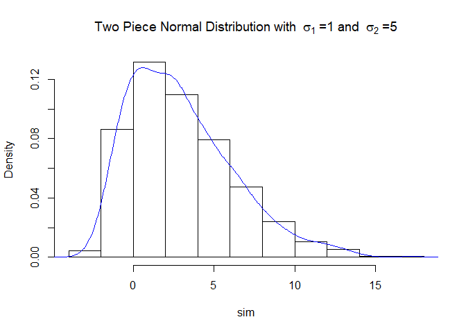

<!-- README.md is generated from README.Rmd. Please edit that file -->

# twopiece

<!-- badges: start -->

[](https://github.com/medewitt/twopiece)
[](https://travis-ci.org/medewitt/twopiece)
[](https://ci.appveyor.com/project/medewitt/twopiece)
<!-- badges: end -->

The goal of twopiece is to …

## Installation

You **cannot** install the released version of twopiece from
[CRAN](https://CRAN.R-project.org) with:

``` r
install.packages("twopiece")
```

And the development version from [GitHub](https://github.com/) with:

``` r
# install.packages("devtools")
devtools::install_github("medewitt/twopiece")
```

## Example

This is a basic example which shows you how to solve a common problem:

``` r
library(twopiece)
## basic example code
```

Generate random numbers from a two piece normal distribution

``` r
sim <- rtp3(1000,0,1,5,rnorm)
hist(sim,
     probability=TRUE, 
     main = bquote("Two Piece Normal Distribution with "~sigma[1]~"=1 and "~sigma[2]~"=5"))
lines(density(sim), col = "blue")
```


